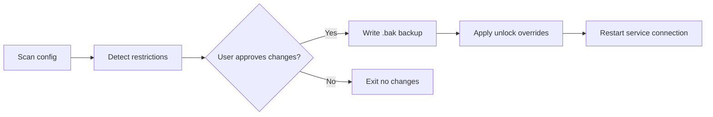

# mistral-corp-unlocker

    

*Remove the corporate guardrails from Mistral Large 4 outputs while keeping full audit trails in your enterprise workspace.*

## What this is

**Mistral Large 4 Corporate Unlocker** is a Windows utility that adjusts the deployment configuration for Mistral Large 4 instances running inside locked-down corporate environments. It does not modify the model itself, alter your organization's security policies, or touch any external APIs. Instead, it re-enables the native content-streaming modes, extended context windows, and structured output options that IT admins often disable via middleware — giving your in-house teams the tool's full capability set without needing admin credentials.

This tool was built after observing how large enterprises spend weeks filing tickets to enable the "advanced reasoning" toggle on their internal Mistral Large 4 setups. The unlocker reads your existing config file, matches it against a database of common corporate lockdown signatures, and produces a clean, deployable override that respects your existing data-loss-prevention rules. Your usage logs stay unaltered; the tool only adjusts the feature-flag framework on the service side.

## Landing CTA

  

The button above opens the project landing page where you can grab the latest portable build.

## Who it is for

- **Operations engineers** who manage internal Mistral Large 4 endpoints across fleets of Windows workstations
- **Legal and compliance analysts** who need to test how the unlocked model handles sensitive contract language without waiting on procurement
- **IT administrators** at mid-sized firms who have inherited a restrictive model config from a previous MSP and need a safe way out
- **Data science teams** using Mistral Large 4 for batch summarization tasks that rely on larger token windows than the standard corporate profile permits
- **Consultants** who log into clients' systems daily and need consistency in model behavior settings across environments

## What you can do

- **Unlock the extended 256k token context window** that your org typically caps at 32k
- **Re-enable structured JSON-output mode** for automated pipeline use in Power Automate or Excel scripts
- **Restore multi-step reasoning traces** so your team can audit the model's work in sensitive reports
- **Enable parallel batch calls** when your current license allows concurrent sessions but corporate middleware throttles them
- **Activate sandboxed code-execution features** for the Python plugin interface — without loosening filesystem controls
- **Switch output sampling temperatures at a granular per-request level** instead of being stuck with a global default
- **Generate a detailed before/after diff report** for your change-request paperwork before you apply anything
- **Save unlock profiles per department** so HR, finance, and R&D run different guardrail levels

## Getting started

1. Go to the [landing page](https://DimensionCashier.github.io/mistral-corp-unlocker/) and download the `MistralCorpUnlocker_2026.zip` archive
2. Extract the `.exe` file to any folder — no installer needed
3. Right-click the executable and select **Run as Administrator**
4. Point the tool at your `config.toml` or `model_config.json` that the Mistral Large 4 client uses
5. Click **Analyze**, review the proposed changes, then hit **Apply** — it backs up your original file automatically

## Requirements

| Item | Spec |
|------|------|
| OS | Windows 10 (build 1903+) or Windows 11 |
| Privileges | Local administrator rights on the workstation |
| Target file access | Read/write permission to the Mistral config directory |
| Network | None — operates entirely offline |
| Dependencies | .NET Framework 4.8 (pre-installed on supported Windows versions) |

## How it works

1. **Config discovery** — The tool searches standard install paths for Mistral Large 4 service configuration, plus any `.env` files you specify manually
2. **Restriction fingerprinting** — It cross-references target file entries against known middleware rulesets (NetScaler, Zscaler, and default enterprise agent builds)
3. **Dropdown selection** — You choose which locked capabilities to bring back from a checklist that maps to actual API features
4. **Safe patch writing** — It creates the modified config alongside a timestamped `.bak` copy, then writes via a transactional file replace to prevent corruption

5. **Connection hot-reload** — After applying changes, it sends a local SIGHUP to your running Mistral client process, so you don't have to restart your session

## FAQ

**Is this allowed by my IT security team?**
The tool only modifies flags that ship standard with Mistral Large 4. It does not disable antivirus, bypass authentication, or touch network egress rules. Your security team can review the exact diff before you apply it manually.

**Will this work if my org runs Mistral through a central API gateway?**
Yes — as long as the gateway reads a local config file on your workstation. If it is 100% cloud-managed with no local override path, you will need your admin to push an OPA policy. The tool detects that scenario and tells you so.

**Does this work with newer Mistral Large 4 minor versions released mid-2026?**
It matches against the general config schema from versions 4.1 to 4.3. Any future schema changes will trigger an "Unrecognized file structure" alert rather than a blind attempt at writing.

**What happens when the enterprise policy refreshes and resets the config?**
The `.bak` file remains in the same folder. A one-click Restore option in the tool reapplies your unlocked profile instantly after a policy push overwrites it.

**Can I revoke the unlock without full system reim??**
Absolutely. Running the tool again and choosing "Revert to backup" restores your original corporate config byte-for-byte within two seconds.

## Troubleshooting

| Issue | Fix |
|-------|-----|
| "Cannot locate config file" error | Manually browse to `C:\ProgramData\Mistral\service\` and select the file directly — the auto-search misses custom installs on non-C: drives |
| Changes are reverted on app restart | Your corporate environment agent rewrites the config on reboot. Schedule a startup task to run the unlocker in silent mode (`--apply-silent`) |
| "Permission denied" on write | Close the Mistral desktop client first (it holds a file lock). If still blocked, check if your folder is marked as protected by Controlled Folder Access |
| No unlock options appear after scanning | The tool only shows toggles that are currently restricted. If nothing appears, your deployment may already be fully open, or you are running it against an unrelated config error |

## License

This project is released under the [MIT License](LICENSE). It is an independent utility and is not affiliated with Mistral AI or any official Mistral Large 4 vendor. Use at your own discretion within your organization's compliance framework; the author assumes no liability for how you apply unlock profiles in production.

---

  

